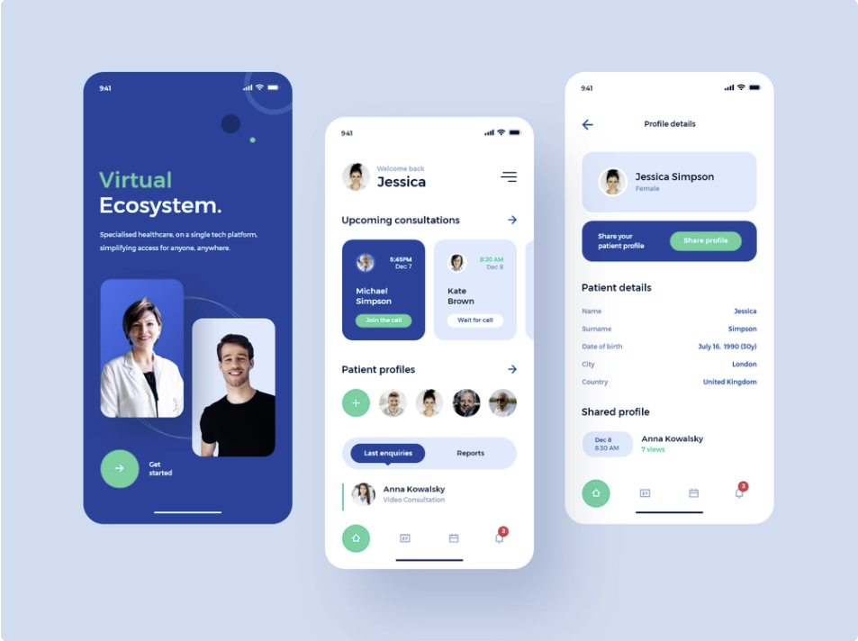
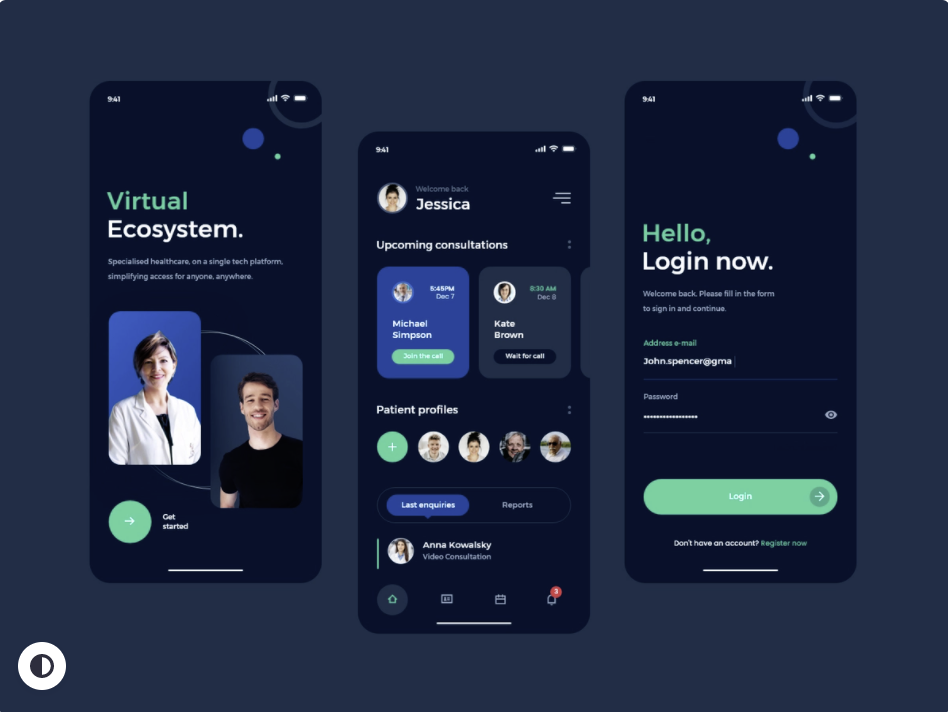

# Mobile application UI for A doctor

# Made with :
 * Ionic 6
 * Angular Typescript
 * HTML5
 * SCSS
 * Contains both dark and light theme

# How to run

 * clone the repo
 * Run npm install
 * Run npm serve  

# UI Credits to Alan Love

# LIGHT THEME

# DARK THEME

